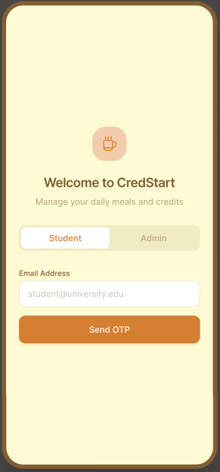
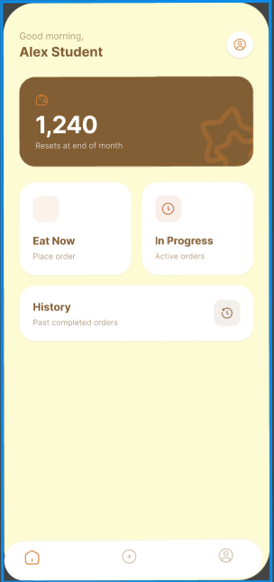

#  CREDSTART - UI/UX Design (Figma AI)

##  Overview
This project showcases a modern UI/UX design prototype created using Figma AI tools. The design focuses on a clean, minimal, and user-friendly interface inspired by fintech applications like CRED.

##  Features
- Modern fintech-inspired UI  
- Clean and minimal design  
- User-friendly navigation  
- Consistent color scheme and layout  

##  Tools Used
- Figma  
- Figma AI  

##  View Full Design
https://www.figma.com/design/qTws0LQQirZJ6ZgDhSikkz/CREDSTART?node-id=0-1&t=Nf08lF7Jztu0BhjR-1

---

##  Design Preview

---

##  Learning Outcome
- Improved UI/UX design skills  
- Learned to use AI tools in design  
- Understood modern app interface structures  

